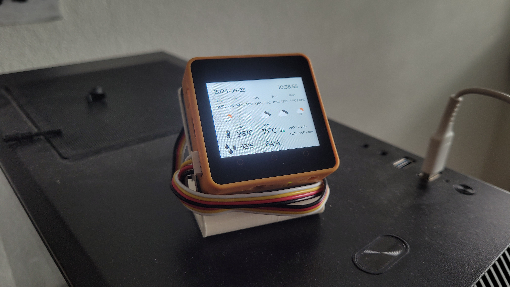
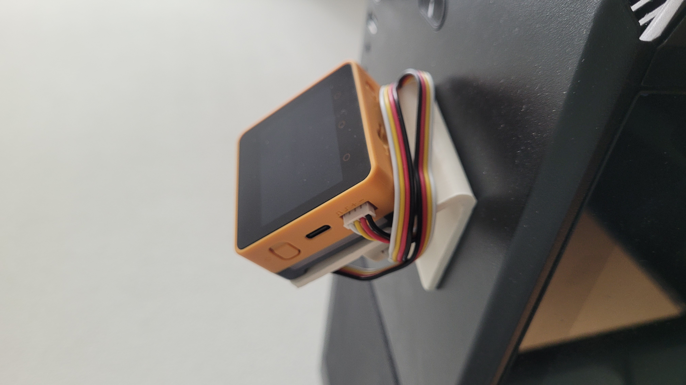
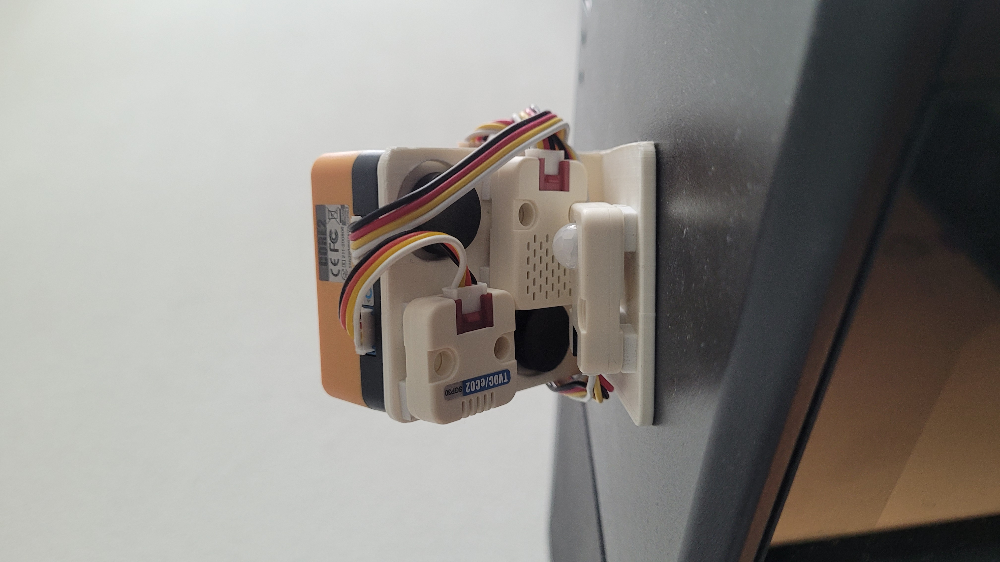
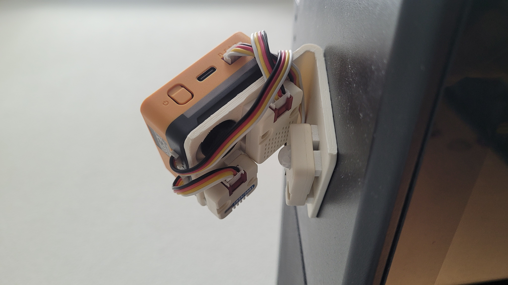

# 🌤 Indoor/Outdoor Weather Monitor with M5stack IoT Device and Cloud Dashboard

Welcome to our project repository! This project involves implementing an indoor/outdoor weather monitor using M5stack IoT devices and sensors, integrated with a web dashboard deployed on the cloud. This solution provides real-time weather monitoring and forecasting, along with historical data visualization, all managed through Google Cloud services.

## 📑 Table of Contents
- [Project Overview](https://github.com/melvin2504/ProjectMeteo/blob/main/README.md#-project-overview)
- [Exciting Features](https://github.com/melvin2504/ProjectMeteo/blob/main/README.md#-exciting-features)
- [Hardware and Software Requirements](https://github.com/melvin2504/ProjectMeteo/blob/main/README.md#-hardware-and-software-requirements)
- [Setup and Deployment Instructions](https://github.com/melvin2504/ProjectMeteo/blob/main/README.md#-setup-and-deployment-instructions)
  - [Google Cloud Deployment Instructions](https://github.com/melvin2504/ProjectMeteo/blob/main/README.md#-google-cloud-deployment-instructions)
  - [Local Deployment](https://github.com/melvin2504/ProjectMeteo/blob/main/README.md#-local-deployment)
  - [Device Configuration](https://github.com/melvin2504/ProjectMeteo/blob/main/README.md#-device-configuration)
- [Project Structure](https://github.com/melvin2504/ProjectMeteo/blob/main/README.md#-project-structure)
- [3D Printing Your M5Stack Core2 Holder](https://github.com/melvin2504/ProjectMeteo/blob/main/README.md#%EF%B8%8F-3d-printing-your-m5stack-core2-holder)
- [Contributors](https://github.com/melvin2504/ProjectMeteo/blob/main/README.md#-contributors)
- [Video Demonstration](https://github.com/melvin2504/ProjectMeteo/blob/main/README.md#-video-demonstration)

## 🚀 Project Overview
This project utilizes the M5stack Core2 IoT device along with various sensors to monitor both indoor and outdoor weather conditions. The data is displayed on the device interface and a cloud-based dashboard built with Streamlit. All data is stored in Google Cloud's BigQuery, allowing for both real-time and historical data analysis.

## ⭐ Exciting Features
- **Indoor Monitoring:** 🌡️ Temperature, humidity, air quality, and presence detection.
- **Outdoor Monitoring:** 🌦️ Current weather conditions and forecasts using OpenWeatherMap API.
- **Cloud Integration:** ☁️ Data storage and retrieval using Google BigQuery.
- **Alerts and Notifications:** 🔊 Text-to-speech announcements for weather conditions when you pass by and visual notifications when air quality is bad.
- **User Interfaces:** 💻 Local interface on the M5stack device and a cloud-based dashboard.
- **Historical Data Visualization:** 📊 Access and analyze past weather data on the Streamlit dashboard and on the M5Stack in a more simplistic way.

## 🛠 Hardware and Software Requirements
- **Hardware:**
  - **M5stack Core2 IoT Device:** A versatile and stackable IoT development kit. [More info](https://docs.m5stack.com/en/core/core2).
  - **ENVIII Sensor (Humidity & Temperature):** Measures indoor humidity and temperature. [Details here](https://shop.m5stack.com/products/env-iii-unit-with-temperature-humidity-air-pressure-sensor-sht30-qmp6988).
  - **Air Quality Sensor:** Monitors indoor air quality. [Further info](https://shop.m5stack.com/products/tvoc-eco2-gas-unit-sgp30).
  - **Motion Sensor:** Detects movement to trigger alerts or actions. [Learn more](https://shop.m5stack.com/products/pir-module).

<br>
<div align="center">
  
  
  
  
</div>
<br>

- **Software:**
  - Google Cloud Platform account
  - OpenWeatherMap API key
  - OpenAi API key for advice generation based on meteorological input
  - Python 3.8+
  - Required Python packages (see `requirements.txt`)

## 📦 Setup and Deployment Instructions

### 🌍 Google Cloud Deployment Instructions

Deploying the application on Google Cloud allows you to utilize powerful cloud-based services for handling data processing, storage, and web hosting. Follow these detailed steps to get your application running on Google Cloud.

#### Step 1: Set Up Google Cloud Project
1. **Create a Google Cloud Project**:
   - Visit the [Google Cloud Console](https://console.cloud.google.com/).
   - Click on "IAM & Admin" in the left menu and then "Create a Project".
   - Enter a project name and select a billing account if necessary. Click 'Create'.

2. **Enable APIs**:
   - In the search bar at the top of the Google Cloud Console, search for "BigQuery API" and "Text-to-Speech API".
   - Enable both APIs for your project.

3. **Create BigQuery Dataset**:
   - Navigate to the BigQuery service.
   - In the BigQuery console, click on your project name and select "Create Dataset".
   - Provide a dataset ID and set other configurations as needed, then click 'Create'.

#### Step 2: Obtain Google Cloud Credentials
1. **Create Service Account**:
   - Go to "IAM & Admin" > "Service accounts".
   - Click "Create Service Account", name it, and grant it project-level roles like BigQuery Admin, and Text-to-Speech User.
   - Click 'Create'.

2. **Create and Download Credentials**:
   - In the service accounts list, click on the newly created service account.
   - Go to "Keys" tab and click on "Add Key" > "Create new key".
   - Choose JSON and download the key file. This is your `google_credentials.json`. This will be usefull for a local use.

#### Step 3: Deploy Application Using Google Cloud Run
1. **Containerize Your Application**:
   - Ensure your project has a `Dockerfile` which includes all necessary instructions to build the image.
   - Build your container image using Google Cloud Build or your local machine.

2. **Push the Container to Container Registry**:
   - Tag your built image appropriately for Google Container Registry.
   - Use `gcloud` commands to push the image to Google Cloud. For example:
     ```sh
     gcloud auth configure-docker
     docker push gcr.io/your-project-id/your-image-name
     ```

3. **Deploy to Cloud Run**:
   - Visit the Cloud Run section in Google Cloud Console.
   - Click "Create Service".
   - Select your image from Container Registry, configure the service settings like memory, allowed requests, and concurrency.
   - Set environment variables as needed (e.g., API keys, service account paths).
   - Click 'Create' to deploy. Cloud Run will provide a URL to access your deployed application.

#### Step 4: Accessing the Application
- Once deployed, access the application via the URL provided by Cloud Run. It will be the endpoint to use in your Micropython code for your M5Stack in order to use backend services.

By following these steps, you'll have a robust deployment of your weather monitoring application running on Google Cloud, leveraging its powerful services for scalability and performance.

### 💻 Local Deployment
1. Clone this repository:
   ```sh
   git clone https://github.com/melvin2504/ProjectMeteo.git
   cd ProjectMeteo
2. Install the required Python packages:
   ```sh
   pip install -r requirements.txt
3. Set up environment variables for Google Cloud and OpenWeatherMap in config.py.

### 📱 Device Configuration
1. Connect the M5stack Core2 to [M5Flow](https://flow.m5stack.com/) and connect the sensors.
2. Customize the Micropython (`M5Stack/display.py`), change the Wi-Fi credentials, and the endpoints for your deployed service.
4. Upload the relevant code from M5Flow to the device.

## 🗂 Project Structure
- **main.py**: Entry point for the Flask application.
- **config.py**: Configuration file for API keys and other settings.
- **google_cloud_utils.py**: Functions for interacting with Google Cloud services.
- **openai_utils.py**: Functions for interacting with OpenAI services.
- **weather.py**: Functions for fetching and processing weather data.
- **requirements.txt**: List of required Python packages.
- **Dockerfile**: Instructions for building a Docker image of the application.

## 🖨️ 3D Printing Your M5Stack Core2 Holder
<br>
<div align="center">
  
  
  
</div>
<br>
To enhance your experience with the M5Stack Core2, you have the option to print a custom 3D holder. This stand not only secures your device but also positions it for optimal interaction and visibility.

### Get the 3D Model
You can find a suitable 3D model for the M5Stack Core2 stand by visiting this [Cults3D page](https://cults3d.com/fr/mod%C3%A8le-3d/gadget/m5stack-core-stand). The page features a specifically designed stand that accommodates the M5Stack Core2 perfectly.

### Download the STL File
The STL file for the 3D model is available in `3DStand/STAND_M5STACK.stl`

### Printing Instructions
Once you have downloaded the STL file, you can use any standard 3D printer to create the holder. Make sure to adjust your printer settings according to the material you choose and the recommendations provided by the STL file’s creator. Optimal settings ensure the best fit and durability of the holder.

### Assembly
After printing, you can place your Core2 on the holder and attach the sensor to the back of the holder using double-sided adhesive tape. Additionally, there are two areas at the back where you can insert magnets to enhance the stability of your M5Stack. However, avoid using neodymium magnets! ⚠️ Neodymium magnets are extremely powerful and can interfere with electronic components, potentially damaging the circuitry of your device.

This custom holder is an excellent way to enhance the usability of your M5Stack Core2 device, making it easy to interact with and adding an extra layer of stability and protection.

## 👥 Contributors
- Melvin Petracca (GitHub: @melvin2504) - Indoor monitoring and device interface.
- Laurent Sierro (GitHub: @Aztol) - Cloud dashboard and Google Cloud integration.

## 🎥 Video Demonstration
- Check out our [YouTube video demonstration](https://www.youtube.com/watch?v=dQw4w9WgXcQ&pp=ygUJcmljayByb2xs) to see the project in action!
